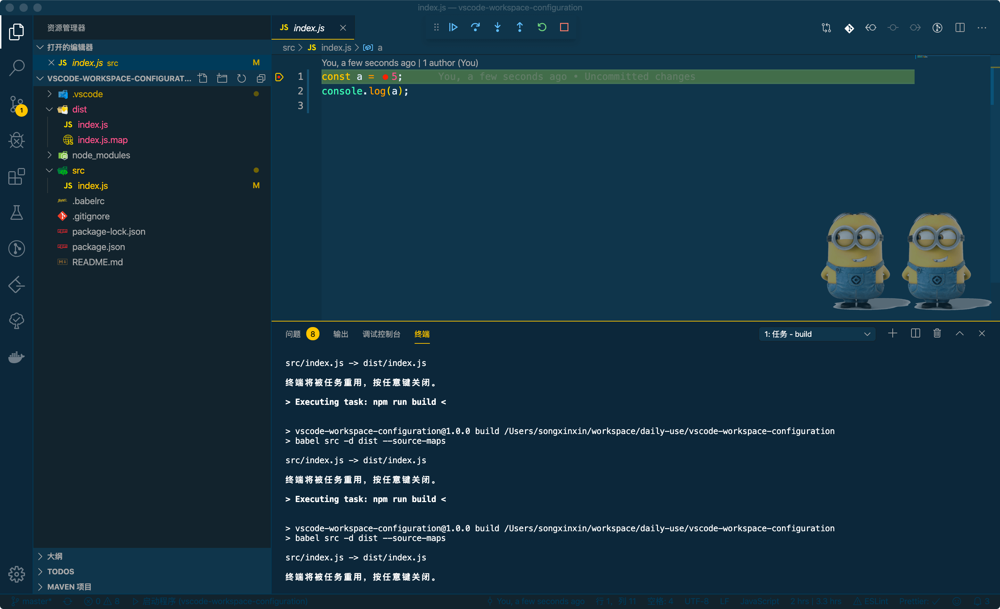

# 使用vscode+es6写nodejs服务端调试配置

前端的小伙伴们在babel等的加持下，已经可以愉快的使用es6来写代码了。

然后对于服务端的nodejs就有点坑爹了，虽然原生支持了es6，但是只是部分支持，一些不支持的特性（比如module）使用了就会报错，所以如果想使用完整的es6来写服务端nodejs，我们还是离不开babel。

下面介绍一下在vscode中使用es6写nodejs的配置方法。

首先在根目录下建立.babelrc文件，写入babel配置，我的配置如下，记得npm安装babel及你需要的presets或者plugin。
```js
{
  "presets": [
    "es2015",
    "stage-3"
  ]
}
```

其实此时已经可以通过babel-node来执行你的es6代码了。
```js 
babel-node src/index.js
```
然而这样的话，vscode里面是无法调试的。所以我们得换个思路，首先将源码使用babel转换，然后执行转换后的代码，附加一份sourcemap就好了。

package.json中增加build命令，使用babel转换es6代码。
```js
"scripts": {
  ......
  "build": "babel src -d dist --source-maps"
}
 ```

创建一个npm task（vscode概念），用来执行npm run build
根据我的理解，tasks用于在launch前执行任务，launch用于读取执行文件。
```js
{
  // See https://go.microsoft.com/fwlink/?LinkId=733558
  // for the documentation about the tasks.json format
  "version": "2.0.0",
  "command": "npm", //执行npm命令
  "isShellCommand": true,
  "showOutput": "always",
  "suppressTaskName": true,
  "tasks": [
    {
      "taskName": "build", //task名称
      "args": [ //npm run build
        "run",
        "build"
      ],
      "isBuildCommand": true
    }
  ]
}
```
该文件在根目录.vscode目录下，名字是tasks.json，如果没有可以自己创建一个。

在vscode的调试配置文件中(.vscode -> launch.json)，进行如下配置 
```js
{
    // Use IntelliSense to learn about possible Node.js debug attributes.
    // Hover to view descriptions of existing attributes.
    // For more information, visit: https://go.microsoft.com/fwlink/?linkid=830387
    "version": "0.2.0",
    "configurations": [
        {
            "type": "node",
            "request": "launch",
            "name": "启动程序",
            "program": "${workspaceFolder}/index.js",
            "sourceMaps": true, //sourcemap打开
            "outFiles": ["${workspaceFolder}/dist/index.js"], //源映射，指定实际执行文件
            "preLaunchTask": "build" //首先执行build task
        },
        {
            "type": "node",
            "request": "attach",
            "name": "附加到端口",
            "address": "localhost",
            "port": 9229
        }
    ]
}

```
## 主要干了这几件事：

- 开启source-map，以便追踪到es6源码
- 运行前先执行build，编译es6源码
- 执行和调试编译后的代码

OK，现在我们就可以愉快的在vscode里用es6写nodejs了，撒花~

参考网址：
- http://stackoverflow.com/questions/38557822/debugging-in-visual-studio-code-with-babel-node
- https://www.cnblogs.com/xjnotxj/p/9437528.html

